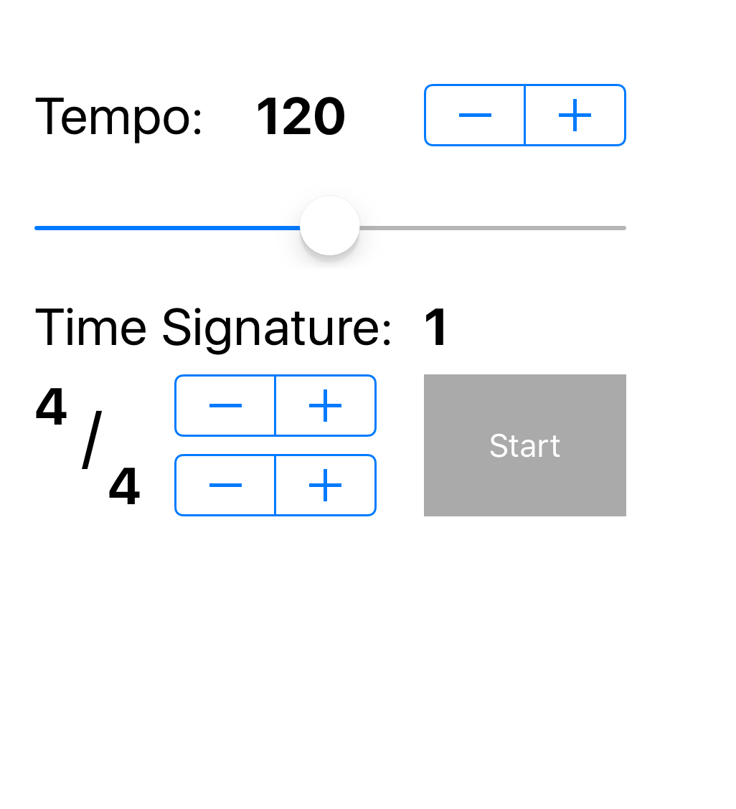

# Ronome

Ronome is a simple metronome app written in Swift for iOS

## Instructions

To run, [import the project into Xcode](https://developer.apple.com/library/ios/recipes/xcode_help-structure_navigator/articles/Adding_an_Existing_Project_to_a_Workspace.html) then [make sure an iPhone device is selected and run.](https://developer.apple.com/library/ios/documentation/IDEs/Conceptual/AppDistributionGuide/LaunchingYourApponDevices/LaunchingYourApponDevices.html). This app was made with the iPhone 6s in mind.

## Screenshot

